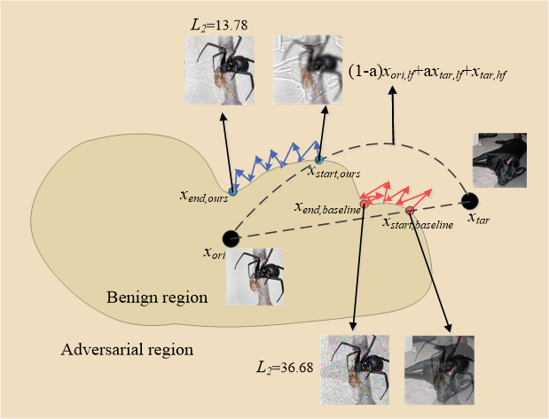

Official code for the paper 'Well Begun is Half Done: a New Initialization Strategy for Targeted Decision-Based Attack'  
Our main idea can be summarized with just two sentences:  
- A closer starting point converges to a closer (local) optimum ( https://placehold.co/600x400?font=roboto);
- Leaving high-frequency components intact enables aggressive low-frequency mixing (The arc).

In the supplementary file 'supp.pdf', we provide more detailed results:

- Ablation study on filters;
- Complete results on ImageNet, including comparison with the Copy-pasting initialization strategy;
- Results on the CIFAR10 dataset. 

## Usage  
When you have the dataset 'Sample_1000' (can be downloaded from [TREMBA](https://github.com/TransEmbedBA/TREMBA)) , please run 'Targeted_attack_whole_dataset.py'. Otherwise, we provide a quick example 'Targeted_attack_onesample.py'.
